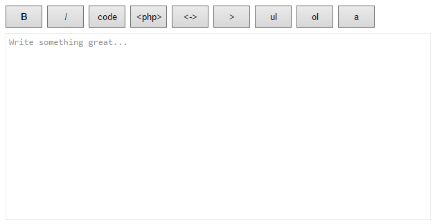

CodeMirror buttons addon
========================

Adds a panel with buttons specified via config.



## Usage

Include scripts needed into webpage.

```html
<script src="bower_components/codemirror/lib/codemirror.js"></script>
<script src="bower_components/codemirror/addon/display/panel.js"></script>
<script src="bower_components/codemirror-buttons/buttons.js"></script>
```

Initialize CodeMirror specifying buttons as an array in `buttons` config property.

```javascript
var editor = CodeMirror.fromTextArea(document.getElementById('text'), {
	mode: 'gfm',
	buttons: [
        {
            hotkey: 'Ctrl-B',
            class: 'bold',
            label: '<strong>B</strong>',
            callback: function (cm) {
                var selection = cm.getSelection();
                cm.replaceSelection('**' + selection + '**');
                if (!selection) {
                    var cursorPos = cm.getCursor();
                    cm.setCursor(cursorPos.line, cursorPos.ch - 2);
                }
            }
        },
        {
            hotkey: 'Ctrl-I',
            class: 'italic',
            label: '<i>I</i>',
            callback: function (cm) {
                var selection = cm.getSelection();
                cm.replaceSelection('*' + selection + '*');
                if (!selection) {
                    var cursorPos = cm.getCursor();
                    cm.setCursor(cursorPos.line, cursorPos.ch - 1);
                }
            }
        },
        {
            class: 'inline-code',
            label: 'code',
            callback: function (cm) {
                var selection = cm.getSelection();
                cm.replaceSelection("`" + selection + "`");
                if (!selection) {
                    var cursorPos = cm.getCursor();
                    cm.setCursor(cursorPos.line, cursorPos.ch - 1);
                }
            }
        },
        {
            class: 'block-php',
            label: '&lt;php&gt;',
            callback: function (cm) {
                var selection = cm.getSelection();
                cm.replaceSelection("```php\n<?php\n" + selection + "\n```\n");
                if (!selection) {
                    var cursorPos = cm.getCursor();
                    cm.setCursor(cursorPos.line - 2, 0);
                }
            }
        },
        {
            class: 'block-code',
            label: '&lt;-&gt;',
            callback: function (cm) {
                var selection = cm.getSelection();
                cm.replaceSelection("```\n" + selection + "\n```\n");
                if (!selection) {
                    var cursorPos = cm.getCursor();
                    cm.setCursor(cursorPos.line - 2, 0);
                }
            }
        },
        {
            class: 'quote',
            label: '>',
            callback: function (cm) {
                cm.replaceSelection("> " + cm.getSelection());
            }
        },
        {
            class: 'ul',
            label: 'ul',
            callback: function (cm) {
                cm.replaceSelection("- " + cm.getSelection());
            }
        },
        {
            class: 'ol',
            label: 'ol',
            callback: function (cm) {
                cm.replaceSelection("1. " + cm.getSelection());
            }
        },
        {
            class: 'a',
            label: 'a',
            callback: function (cm) {
                var selection = cm.getSelection();
                var text = '';
                var link = '';

                if (selection.match(/^https?:\/\//)) {
                    link = selection;
                } else {
                    text = selection;
                }
                cm.replaceSelection('[' + text + '](' + link + ')');

                var cursorPos = cm.getCursor();
                if (!selection) {
                    cm.setCursor(cursorPos.line, cursorPos.ch - 3);
                } else if (link) {
                    cm.setCursor(cursorPos.line, cursorPos.ch - (3 + link.length));
                } else {
                    cm.setCursor(cursorPos.line, cursorPos.ch - 1);
                }
            }
        }
    ],
});
```

Optionally use stylesheet included to make buttons look a bit better:

```html
<link rel="stylesheet" href="bower_components/codemirror-buttons/buttons.css">
```
